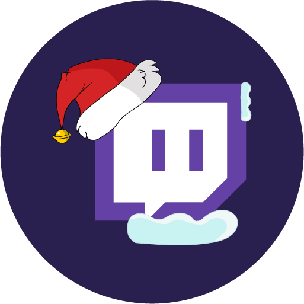
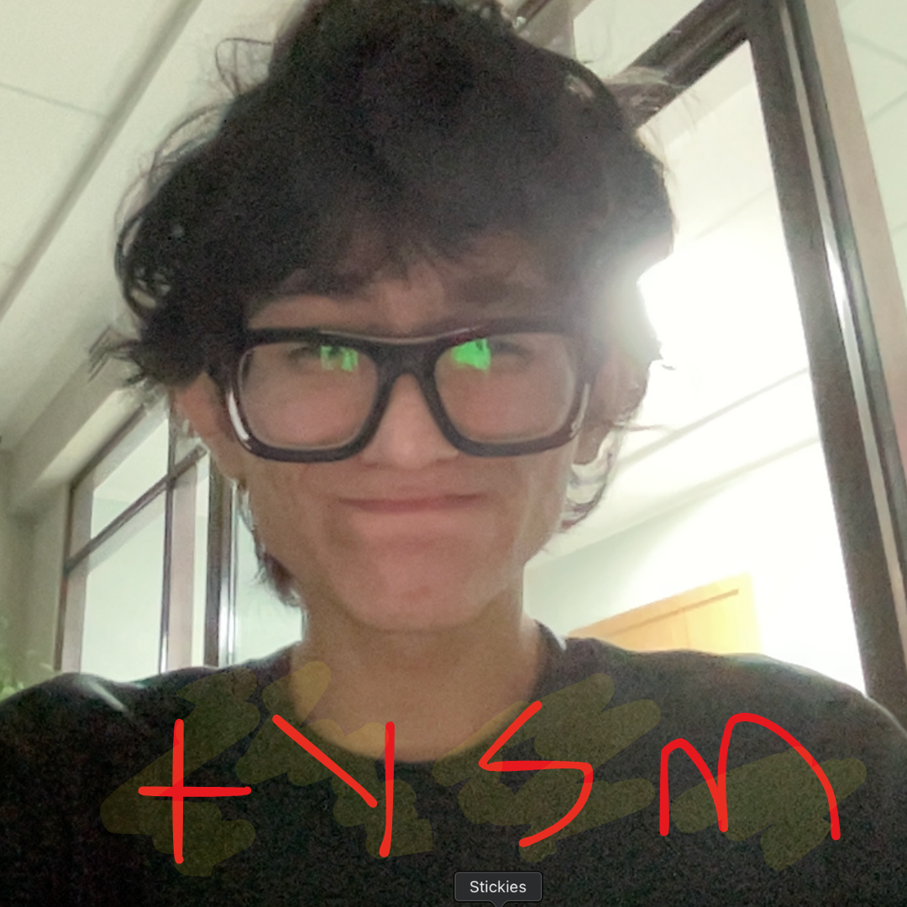

# make your website retired. LOL


### Stream: Live on Twitch

I streamed the whole process here on my Twitch channel. You can watch the recording here:

[](https://www.twitch.tv/videos/2329114716) [](https://youtu.be/_wTaMLL4by0?si=nvSbaOktXjk3aw7l)


### Try it now -> [click me...](https://theopencommunity.co) (it's absolutely FREE! 🎉)

### 🚀 Powered by AI/ML API
Tutorial Powered by [AI/ML API](https://aimlapi.com/?via=ibrohim). Use the code IBROHIMXAIMLAPI for 1 week free access to over 200 AI models. Including Text2Image, Text2Speech, Speech2Text, Text2Video but not limited. Use the following Link → https://aimlapi.com/?via=ibrohim .

### 📒 Tutorial
Step-by-Step tutorial available on [TUTORIAL.md](https://github.com/abdibrokhim/ai-coding-interviewer/blob/main/TUTORIAL.md) . Learn how to build your from scratch.

## 📦 Run Locally

Clone the repository with:

```shell
git clone https://github.com/abdibrokhim/neuronostalgia-hack24
```

Install the dependencies with:

```shell
npm install
```
and 

Run the development server with:

```shell
npm run dev
```
Open http://localhost:3000 in your browser.

## 🥂 Discord community

Join our community on Discord [Open Community](https://discord.gg/nVtmDUN2sR)

Say me " Hi, 👋 " : https://www.linkedin.com/in/abdibrokhim/

All tutorials available here: 
* Github: https://github.com/abdibrokhim?tab=repositories 
* Medium: https://medium.com/@abdibrokhim 
* Dev: https://dev.to/abdibrokhim

Join us! Open Community:
* LinkedIn: https://linkedin.com/company/opencommunity
* X: https://x.com/@xopencommunity
* Discord: https://discord.gg/nVtmDUN2sR
* YouTube: https://youtube.com/@theopencommunity
* Instagram: https://instagram.com/theopencommunity

## 🐞 Bug report or Feature request

Message me at [click me](https://theopencommunity.co)

## 👋 Want to Contribute?

Kindly check the [CONTRIBUTING.md](https://github.com/abdibrokhim/neuronostalgia-hack24/blob/main/CONTRIBUTING.md)

## ⭐️ Star History

[](https://star-history.com/#abdibrokhim/neuronostalgia-hack24&Date)

## 🙏 Support

Become a [Patron](https://www.patreon.com/abdibrokhim). follow on [LinkedIn](https://www.linkedin.com/in/abdibrokhim/).

## 🦄 Want to learn build stuff?

Whether you need help with… ( you name it, 🤓 lol ). I’m here https://topmate.io/abdibrokhim to support you.

Leave your feedbacks, reactions, and comments on this [LinkedIn post]()

tysm,

