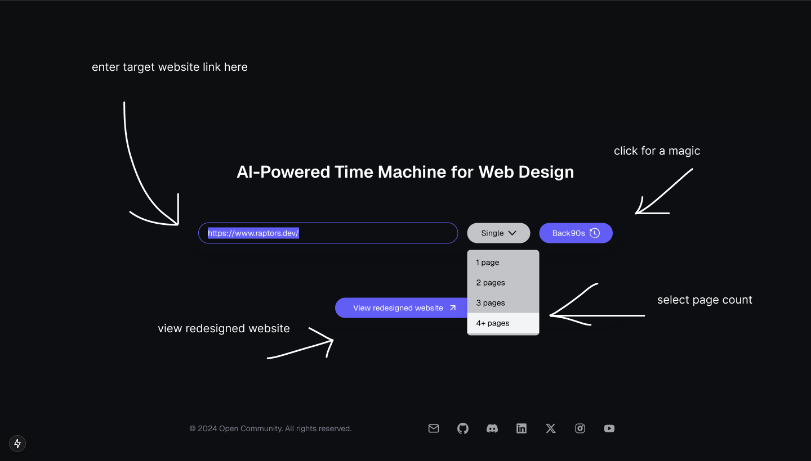

# Building a tool that transforms modern websites into authentic 90s-style designs while preserving core functionality using AI/ML API

<details>
<summary>⬇️ Table of Contents ⬇️</summary>

- [Introduction](#introduction)
  - [AI/ML API](#aiml-api)
  - [Firecrawl](#firecrawl)
  - [Next.js](#nextjs)
  - [Tailwind CSS](#tailwind-css)
  - [Clerk Auth](#clerk-auth)
  - [Vercel](#vercel)
- [Prerequisites](#prerequisites)
- [Getting Started](#getting-started)
  - [Create a New Next.js Project](#create-a-new-nextjs-project)
  - [Design the UI](#design-the-ui)
  - [API Routes](#api-routes)
- [Further Improvements](#further-improvements)
- [Conclusion](#conclusion)
  - [Other Interesting Tutorials](#other-interesting-tutorials)
  - [Try what you have built so far](#try-what-you-have-built-so-far)
- [Bonus](#bonus)

</details>

Hey, hey! 👋

Wassap?!

I was sitting in the lecture but it was too boring. Then, I prompt ChatGPT what to do. LOL. And, it said: "make something cool, but worst at the same time". So, I came up with this idea. Let's build a platform that transforms modern websites into authentic 90s-style designs while preserving core functionality. 😂 LMAO.

Interesting? 

Follow along! 🚀

## Introduction

In this tutorial, we will build a website that transforms modern websites into authentic 90s-style designs while preserving core functionality. We will use `AI/ML API` as a core component to redesign the whole website. We will also use `Next.js`, `Tailwind CSS`, `Clerk Auth`, and `Vercel` to build and deploy the website. All those tools are pretty easy to use and will help us build a powerful and scalable website in no time. 🤓 

The idea and implementation are pretty simple. We will take a modern website URL as input. Then, prompt the user to select the page counts. I mean whether they want to transform the whole website or just a single landing page or 2, 3, etc. pages. It will help us a lot; 1) to save API tokens and reduce the cost, and 2) also minimize the API calls. Then, we will crawl the website and save the data in a `JSON file`. So, later on we could easily get the data that we need. After that, we create a new `demo` folder for the transformed website. Everything will be placed inside this folder. First, we will build landing (main) page. Then iteratively (looping) build other pages that are interconnected with the main page with navigation links. We will prompt `GPT-4o` to redesign the website. Voila! We have a new 90s-style website. 🤩

Here's the UI of our website:


Pretty crazy, right? 🔥 

I shamelessly copied from [lovido.lol](https://lovido.lol). LMAO. 😂

Especcially, the color palette. 🎨

```css
  --violet: #625df5;
  --dark-violet: #625df580;
  --bg-a: #0B0E11;
  --text-a: #FFFFFF;
  --text-b: #C3C4C7;
  --text-c: #787B89;
  --orange: #ee5d19;
```

Save it. Well crafted color palette you have ever seen. By me for you 🤝

So, let's get started! 🚀

### AI/ML API

AI/ML API is a game-changing platform for developers and SaaS entrepreneurs looking to integrate cutting-edge AI capabilities into their products. It offers a single point of access to over 200 state-of-the-art AI models, covering everything from NLP to computer vision.

Key Features for Developers:

* Extensive Model Library: 200+ pre-trained models for rapid prototyping and deployment. 📚
* Customization Options: Fine-tune models to fit your specific use case. 🎯
* Developer-Friendly Integration: RESTful APIs and SDKs for seamless incorporation into your stack. 🛠️
* Serverless Architecture: Focus on coding, not infrastructure management. ☁️

[Get Started for FREE](https://aimlapi.com/?via=ibrohim) 🧑‍🍳

Use the code `IBROHIMXAIMLAPI` for [1 week FREE Access](https://aimlapi.com/?via=ibrohim)

[Deep Dive](https://docs.aimlapi.com/) into AI/ML API Documentation (very detailed, can’t agree more) 📖

Here's a brief tutorial: [How to get API Key from AI/ML API. Quick step-by-step tutorial with screenshots for better understanding.](https://medium.com/@abdibrokhim/how-to-get-api-key-from-ai-ml-api-225a69d0bb25)

### Firecrawl

Firecrawl turns entire websites into clean, LLM-ready markdown or structured data. Scrape, crawl and extract the web with a single API. Ideal for AI companies looking to empower their LLM applications with web data.

Key Features for Developers:


Documentation: [Firecrawl](https://docs.firecrawl.dev/introduction)

### Next.js

Next.js is a React framework that enables server-side rendering and static site generation for React applications. It provides a range of features that make it easier to build fast, scalable, and SEO-friendly web applications.

Documentation: [Next.js](https://nextjs.org/docs/getting-started)

### Tailwind CSS

Tailwind CSS is a utility-first CSS framework that makes it easy to build custom designs without writing custom CSS. It provides a range of utility classes that can be used to style elements directly in the HTML.

Documentation: [Tailwind CSS](https://tailwindcss.com/docs)

### Clerk Auth

Clerk is an authentication platform that provides a range of features for managing user authentication and authorization in web applications. It offers a range of features, including social login, multi-factor authentication, and user management.

Documentation: [Clerk](https://docs.clerk.dev/)

Here's a brief tutorial on: [How to create account on Clerk and setup new project](https://medium.com/@abdibrokhim/how-to-create-account-on-clerk-and-setup-a-new-project-532be3545642)

### Vercel

Vercel is a cloud platform to deploy and host web applications. It offers a range of features, including serverless functions, automatic deployments, and custom domains.

> Documentation: [Vercel](https://vercel.com/docs)

Here's a brief tutorial: [How to Deploy Apps to Vercel with ease](https://medium.com/@abdibrokhim/how-to-deploy-apps-to-vercel-with-ease-93fa0d0bb687)


## Prerequisites

Before we get started, make sure you have the following installed on your machine:

* [Node.js](https://nodejs.org/). Here's a short tutorial on [How to setup Node.js on my computer with ease.](https://medium.com/@abdibrokhim/how-to-setup-node-js-on-my-computer-with-ease-b5fe9b766513)
* [npm or yarn](https://www.npmjs.com/) or [yarn](https://yarnpkg.com/)
* [AI/ML API Key](https://aimlapi.com/?via=ibrohim). Here's a tutorial on [How to get API Key from AI/ML API](https://medium.com/@abdibrokhim/how-to-get-api-key-from-ai-ml-api-225a69d0bb25)
* [Firecrawl API Key](https://www.firecrawl.dev/). Here's a tutorial on [How to get API Key from Firecrawl](https://dev.to/abdibrokhim/how-to-get-api-key-from-firecrawl-4d5g)
* [Clerk Auth Account](https://clerk.com/). Here's a brief tutorial on: [How to create account on Clerk and setup new project](https://medium.com/@abdibrokhim/how-to-create-account-on-clerk-and-setup-a-new-project-532be3545642)
* [Vercel Account](https://vercel.com/). Here's a brief tutorial on: [How to create account on Vercel](https://medium.com/@abdibrokhim/how-to-deploy-apps-to-vercel-with-ease-93fa0d0bb687)

## Getting Started

### Create a New Next.js Project

Let's get started by creating a new Next.js project:

```bash
npx create-next-app@latest
```

It will ask you a few *simple questions:

What is your project named? Here, you should enter your app name. For example: `Retrofy` (or whatever you wish). For the rest of the questions, simply hit enter:

Here’s what you’ll see:
```bash
✔ Would you like to use TypeScript? … No / Yes
✔ Would you like to use ESLint? … No / Yes
✔ Would you like to use Tailwind CSS? … No / Yes
✔ Would you like your code inside a `src/` directory? … No / Yes
✔ Would you like to use App Router? (recommended) … No / Yes
✔ Would you like to use Turbopack for `next dev`? … No / Yes
✔ Would you like to customize the import alias (`@/*` by default)? … No / Yes
```

Open your project with Visual Studio Code:

```bash
cd Retrofy
code .
```

### Design the UI

#### Notification Component

Let's firstly setup the `notification` component. Create a new folder `utils` then create a new file `notify.tsx` inside it:

```typescript
import React, { useEffect } from 'react';

type NotificationProps = {
  message: string;
  type: 'error' | 'success' | 'info';
  onClose: () => void;
};

const Notification: React.FC<NotificationProps> = ({ message, type, onClose }) => {
  useEffect(() => {
    const timer = setTimeout(() => {
      onClose();
    }, 3000); // Auto-close after 3 seconds
    return () => clearTimeout(timer);
  }, [onClose]);

  const bgColor = type === 'error' ? 'bg-[#f84f31]' : type === 'success' ? 'bg-[#23c552]' : 'bg-[#1e90ff]';

  return (
    <div className={`fixed w-[300px] text-xs sm:text-md top-10 left-1/2 transform -translate-x-1/2 ${bgColor} text-white px-4 py-2 rounded-md shadow-lg z-50`}>
      <p>{message}</p>
    </div>
  );
};

export default Notification;
```

Then add `loader` in `loader.tsx` file:

```typescript
export const loader = () => (
    <svg xmlns="http://www.w3.org/2000/svg" width="1em" height="1em" viewBox="0 0 24 24">
    <circle cx={4} cy={12} r={3} fill="currentColor">
        <animate id="svgSpinners3DotsScale0" attributeName="r" begin="0;svgSpinners3DotsScale1.end-0.25s" dur="0.75s" values="3;.2;3" />
    </circle>
    <circle cx={12} cy={12} r={3} fill="currentColor">
        <animate attributeName="r" begin="svgSpinners3DotsScale0.end-0.6s" dur="0.75s" values="3;.2;3" />
    </circle>
    <circle cx={20} cy={12} r={3} fill="currentColor">
        <animate id="svgSpinners3DotsScale1" attributeName="r" begin="svgSpinners3DotsScale0.end-0.45s" dur="0.75s" values="3;.2;3" />
    </circle>
    </svg>
);
```

#### App Interface

Creating the main interface of the app is pretty simply. We need just a few stuff; header text, input, one button for dropdown, one button for processing, and one button for viewing the transformed website. And few functions to handle the events.

Let's integrate the `notification` component first. Open `src/app/page.tsx` and add the following code:

```typescript
'use client';

import Image from 'next/image';
import React, { useEffect, useState } from 'react';
import Notification from './utils/notify';
import { loader } from './utils/loader';
import Footer from './components/Footer';

export default function Home() {

    const [notification, setNotification] = useState<{ message: string; type: 'error' | 'success' | 'info' } | null>(null);  // notification message
    const messages = {
        crawling: 'Crawling website...',
        scraping: 'Scraping website...',
        redesigning: 'Redesigning website...',
        stillRedesigning: 'Still redesigning website...',
        crawledSuccess: 'Website crawled successfully.',
        scrapedSuccess: 'Website scraped successfully.',
        redesignSuccess: 'Website redesigned successfully.',
    }

    return (
        <div className="grid grid-rows-[20px_1fr_20px] bg-[var(--bg-a)] items-center justify-items-center min-h-screen pb-8 gap-8 p-4 font-[family-name:var(--font-geist-sans)]">
            <main className="flex flex-col gap-8 row-start-2 items-center w-full max-w-7xl">
            
                {notification && (
                    <Notification
                    message={notification.message}
                    type={notification.type}
                    onClose={() => setNotification(null)}
                    />
                )}
            </main>
        </div>
    );
}
```

Next, let's add the `header`. Put it right after the notification:

```typescript
          <div className="mb-6 mt-16 sm:mt-24 w-full max-w-2xl text-center text-xl sm:text-2xl md:text-3xl leading-9">
            <h1 className="text-[var(--text-a)] font-semibold flex flex-row gap-2">
              <p className="text-center mx-auto">AI-Powered Time Machine for Web Design</p>
            </h1>
          </div>
```

Let's put all the states. otherwise it will be confusing. Add the following code:

```typescript
  const [webUrl, setwebUrl] = useState('');
  const [loading, setLoading] = useState(false);
  const [scrapedDataFilePath, setScrapedDataFilePath] = useState<string | null>(null);
  const [redesignedFolderPath, setRedesignedFolderPath] = useState<string | null>(null);
  const scrapeStates = {
    singlePage: 'Single',
    fullSite: 'Multi',
  }
  const [scrapeState, setScrapeState] = useState(scrapeStates.singlePage);
  const [pageCount, setPageCount] = useState<number>(1);
  const [showDropdown, setShowDropdown] = useState(false);

```

Then, add the `input` field:

```typescript
            <input
              type="text"
              value={webUrl}
              onChange={(e) => setwebUrl(e.target.value)}
              placeholder="Enter website link here..."
              className="placeholder:text-[var(--text-c)] placeholder:text-sm text-sm bg-transparent focus:outline-none text-[var(--text-a)] w-full px-4 py-2 rounded-full shadow transition-colors border border-[var(--ring)] focus:border-[var(--violet)]"
              disabled={loading}
            />
```

Next, add the `dropdown` button for selecting number of pages to be scraped or crawled:

```typescript
            <button
                disabled={loading}
                onClick={() => setShowDropdown(!showDropdown)}
                className={`flex items-center justify-center py-2 px-4 sm:px-8 text-sm md:text-sm rounded-full shadow transition-colors 
                  ${loading 
                    ? 'cursor-not-allowed bg-[var(--text-b)] text-[var(--bg-a)]' 
                    : 'cursor-pointer bg-[var(--text-b)] hover:bg-[var(--text-c)] text-[var(--bg-a)]'
                  }`}
              > <span className="mr-2">{scrapeState}</span>
                {!loading 
                  ? (
                    <Image
                      aria-hidden
                      src="/line-angle-down-icon.svg"
                      alt="line-angle-down-icon"
                      width={14}
                      height={14}
                    />
                  )
                  : loader()
                }
              </button>
              {showDropdown && (
                <div className="absolute mt-12 w-32 rounded-md shadow-lg bg-[var(--text-b)] ring-1 ring-black ring-opacity-5 z-10">
                  <div className="py-1" role="menu">
                    <button
                      className="block w-full text-left px-4 py-2 text-sm hover:bg-gray-100"
                      onClick={() => selectPages(1)}
                      role="menuitem"
                    >
                      1 page
                    </button>
                    <button
                      className="block w-full text-left px-4 py-2 text-sm hover:bg-gray-100"
                      onClick={() => selectPages(2)}
                      role="menuitem"
                    >
                      2 pages
                    </button>
                    <button
                      className="block w-full text-left px-4 py-2 text-sm hover:bg-gray-100"
                      onClick={() => selectPages(3)}
                      role="menuitem"
                    >
                      3 pages
                    </button>
                    <button
                      className="block w-full text-left px-4 py-2 text-sm hover:bg-gray-100"
                      onClick={() => selectPages(4)}
                      role="menuitem"
                    >
                      4+ pages
                    </button>
                  </div>
                </div>
            )}
```

Add function to select and set the number of pages:

```typescript
const selectPages = (count: number) => {
    setPageCount(count);
    setScrapeState(count === 1 ? scrapeStates.singlePage : scrapeStates.fullSite);
    setShowDropdown(false);
};
```


Then, add the `process` button:

```typescript
<button
    disabled={webUrl === '' || loading}
    onClick={handleScrape}
    className={`flex items-center justify-center py-2 px-4 sm:px-8 text-sm md:text-sm rounded-full shadow transition-colors 
        ${webUrl === '' || loading 
        ? 'cursor-not-allowed bg-[var(--ring)] text-[var(--text-a)]' 
        : 'cursor-pointer bg-[var(--violet)] hover:bg-[var(--ring)] text-[var(--text-a)]'
        }`}
    > <span className="mr-2">Back90s</span>
    {!loading 
        ? (
        <Image
            aria-hidden
            src="/history-line-icon.svg"
            alt="Download Icon"
            width={18}
            height={18}
        />
        )
        : loader()
    }
</button>
```

Finally, add the `view` button to view the *redesigned website:

```typescript
{redesignedFolderPath && (
    <div className="w-full max-w-3xl mx-auto flex flex-col items-center p-4 mb-8 shadow-lg gap-4 bg-[var(--bg-a)] rounded-full">
        <a
        href={redesignedFolderPath!}
        target="_blank"
        rel="noopener noreferrer"
        className="flex items-center justify-center py-2 px-4 sm:px-8 text-sm md:text-sm rounded-full shadow transition-colors bg-[var(--violet)] hover:bg-[var(--ring)] text-[var(--text-a)]"
        >
        <span className="mr-2">View redesigned website</span>
        <Image
            aria-hidden
            src="/arrow-top.svg"
            alt="External Link Icon"
            width={18}
            height={18}
        />
        </a>
    </div>
)}
```

> All the above code should be placed inside the `main` tag.

Interesting part, implementing functions to handle the different stuff. Let's start with the `handleScrape` function:

```typescript
const handleScrape = () => {
    if (pageCount === 1) {
        scrapeUrl();
    } else {
        crawlUrl();
    }
};
```

It will select specific function based on the `pageCount`. If it's `1`, then it will call `scrapeUrl` function. Otherwise, it will call `crawlUrl` function.

Next, let's implement the `scrapeUrl` function:

```typescript
const scrapeUrl = async () => {
    if (!webUrl) return;

    setLoading(true);
    setNotification({ message: messages.scraping, type: 'info' });

    try {
    const response = await fetch('/api/scrape', {
        method: 'POST',
        headers: { 'Content-Type': 'application/json' },
        body: JSON.stringify({ url: webUrl }),
    });

    const data = await response.json();

    if (response.ok) {
        setNotification({ message: messages.scrapedSuccess, type: 'success' });
        const scrapedDataMsg = data.message;
        const scrapedDataFilePath = data.filePath;
        console.log("====================================")
        console.log(scrapedDataMsg);
        console.log('Scraped data saved at:', scrapedDataFilePath);

        setScrapedDataFilePath(scrapedDataFilePath);
    } else {
        setNotification({ message: data.error || 'An unexpected error occurred.', type: 'error' });
    }
    } catch (error) {
        console.error('Error crawling website:', error);
        alert('An unexpected error occurred.');
    } finally {
        setLoading(false);
    }
};
```

The `scrapeUrl` function will send a `POST` request to the `/api/scrape` endpoint with the website URL. It will then display a notification based on the response from the server. From the response, it will set the `scrapedDataFilePath` state with the file path of the scraped data. And `scrapedDataFilePath` is always `markdown` file in this case. For example: `scraped_1734452873592.md`.

Next, let's implement the `crawlUrl` function:

```typescript
const crawlUrl = async () => {
    if (!webUrl) return;

    setLoading(true);
    setNotification({ message: messages.crawling, type: 'info' });

    try {
    const response = await fetch('/api/firecrawl', {
        method: 'POST',
        headers: { 'Content-Type': 'application/json' },
        body: JSON.stringify({ url: webUrl }),
    });

    const data = await response.json();

    if (response.ok) {
        setNotification({ message: messages.crawledSuccess, type: 'success' });
        const scrapedDataMsg = data.message;
        const scrapedDataFilePath = data.jsonFilePath;
        console.log("====================================")
        console.log(scrapedDataMsg);
        console.log('Crawled data saved at:', scrapedDataFilePath);

        // Crawled data saved at: /Users/abdibrokhim/VSCode/projects/retroed/files/scraped_1734447602439.json

        setScrapedDataFilePath(scrapedDataFilePath);
    } else {
        setNotification({ message: data.error || 'An unexpected error occurred.', type: 'error' });
    }
    } catch (error) {
        console.error('Error scraping website:', error);
        alert('An unexpected error occurred.');
    } finally {
        setLoading(false);
    }
};
```

The `crawlUrl` function will send a `POST` request to the `/api/firecrawl` endpoint with the website URL. It will then display a notification based on the response from the server. From the response, it will set the `scrapedDataFilePath` state with the file path of the scraped data. And `scrapedDataFilePath` is always `json` file in this case. For example: `scraped_1734447602439.json`.

Well, okey. Why JSON? Because, it's easier to work with JSON data. We can easily get the data that we need. For example, we can get the `title`, `description`, `keywords`, `images`, `links`, etc. from the JSON file. It's pretty simple. 🤓 (just believe me. lmao)

Now, we need `useEffects` to listen to the `scrapedDataFilePath` state. If it's not `null`, then we will call `redesignWebsite` function. And, set the `scrapedDataFilePath` state to `null`:

```typescript
useEffect(() => {
    if (scrapedDataFilePath) {
        redesignWebsite();
        setScrapedDataFilePath(null);
    }
}, [scrapedDataFilePath]);
```

Next, let's implement the `redesignWebsite` function:

```typescript
const redesignWebsite = async () => {
    setLoading(true);
    setNotification({ message: messages.redesigning, type: 'info' });

    try {
    const response = await fetch('/api/redesign', {
        method: 'POST',
        headers: { 'Content-Type': 'application/json' },
        body: JSON.stringify({ filePath: scrapedDataFilePath, ptype: pageCount }),
    });

    const data = await response.json();

    if (response.ok) {
        setNotification({ message: messages.redesignSuccess, type: 'success' });
        const newwebsitepath = data.newwebsitepath;
        console.log("====================================")
        console.log('Website redesigned inside folder=', newwebsitepath);
        setRedesignedFolderPath(newwebsitepath);
    } else {
        setNotification({ message: data.error || 'An unexpected error occurred.', type: 'error' });
    }
    } catch (error) {
        console.error('Error redesigning website:', error);
        alert('An unexpected error occurred.');
    } finally {
        setLoading(false);
    }
};
```

The `redesignWebsite` function will send a `POST` request to the `/api/redesign` endpoint with the scraped data file path and the page count. It will then display a notification based on the response from the server. From the response, it will set the `redesignedFolderPath` state with the folder path of the redesigned website. ( spoiler; it's always `demo` folder ).


### API Routes


#### App Info

You can also change your app details. Just open `src/app/layout.tsx` and update both `title` and `description` fields:

```typescript

export const metadata: Metadata = {
  title: "make your website retired. LOL",
  description: "make your website retired. using AI-Powered Time Machine for Web Design. LMAO",
};
```

Next step let's quickly set up environment variables and test it locally.

### Environment Variables

Open `.env` file and add the following environment variables:

```bash
FIRECRAWL_API_KEY=...
AIML_API_KEY=...
```

### Run Locally

#### Start the App

Now, you can run the application locally with the following command:

```bash
npm run dev
```

Open http://localhost:3000 in your browser to see the application running.

You should see something similar to this:


### Testing

Here's an example of how you can test the application.



Enter this link `https://www.raptors.dev/` and select `4+ pages` from dropdown. Then, click on `Back90s` button. It will take some time to transform the website. After that, you will see the another button below input field. Click on it. It will take you to the transformed website. 🚀

I streamed the whole process here on my Twitch channel. You can watch the recording here:

[](https://www.twitch.tv/videos/2329114716)

[](https://youtu.be/_wTaMLL4by0?si=nvSbaOktXjk3aw7l)


## Further Improvements

You can integrate Clerk Auth for user authentication and authorization. It's a great way to add user authentication to your application.

Here's a brief tutorial on: 
- [How to create account on Clerk and setup new project](https://medium.com/@abdibrokhim/how-to-create-account-on-clerk-and-setup-a-new-project-532be3545642)
- [How to setup Clerk Auth on your application](https://github.com/abdibrokhim/ai-coding-interviewer/blob/main/TUTORIAL.md#clerk-auth-1)

Deploy the application to Vercel. Here's a brief tutorial: [How to Deploy Apps to Vercel with ease](https://medium.com/@abdibrokhim/how-to-deploy-apps-to-vercel-with-ease-93fa0d0bb687)

Hype up your application by sharing it on **Product Hunt** and **X (Twitter)**. Here's a brief tutorial: [How to hype up the projects on socials like Product Hunt and X (Twitter)](https://github.com/abdibrokhim/ai-coding-interviewer/blob/main/TUTORIAL.md#hype-it-up)


## Conclusion

In this tutorial we learned how to use AI in a worst way. 😂 LMAO.

I hope you enjoyed building this project and learned something new. If you have any questions or feedback, feel free to [Book a Call or DM me](https://topmate.io/abdibrokhim). I would love to help you out with any questions you may have. 🤓

All the code for this project is available on GitHub. It's Open Source 🌟. [AI-Powered Time Machine for Web Design](https://github.com/abdibrokhim/neuronostalgia-hack24/).

Save this tutorial for later reference: 
- it's always available on [Medium](https://medium.com/@abdibrokhim/building-a-tool-that-transforms-modern-websites-into-authentic-90s-style-designs-while-preserving-95a835b5b7a0) 
- and [Dev Community](https://dev.to/abdibrokhim/building-a-tool-that-transforms-modern-websites-into-authentic-90s-style-designs-using-aiml-api-5ame) of course for FREE! 🎉

### Other interesting tutorials:
*with step-by-step explanations and screenshots:*

on [Medium](https://medium.com/@abdibrokhim/who-is-ibrohim-abdivokhidov-abdibrokhim-9d29fb52cb2b):

* [Building Chat With PDF from Scratch with Advanced AI/ML API and Pinecone Leading Vector Database](https://medium.com/@abdibrokhim/building-chat-with-pdf-from-scratch-with-advanced-ai-ml-api-and-pinecone-leading-vector-database-2dbdb6b3e470)

* [Let's build Startup. Step-by-Step Tutorial on Building AI Coding Interviewer (e.g., PrepAlly) with AI/ML API and Integration with Clerk Auth and Deploying to Vercel](https://medium.com/@abdibrokhim/lets-build-startup-2eb5ddfab4af)

* [Comprehensive and Step-by-Step Tutorial on Building an AI text Humanizer with AI/ML API, Next.js, Tailwind CSS and Integration with Clerk Auth and Deploying to Vercel](https://medium.com/@abdibrokhim/comprehensive-and-step-by-step-tutorial-on-building-an-ai-text-humanizer-with-ai-ml-api-next-js-d42c4850a31c)

* [Building an AI Sticker Maker Platform with AI/ML API, Next.js, React, and Tailwind CSS using OpenAI GPT-4o and DALL-E 3 Models.](https://medium.com/@abdibrokhim/building-an-ai-sticker-maker-platform-with-ai-ml-api-next-js-8b0767a7e159)

* [Building a Chrome Extension from Scratch with AI/ML API, Deepgram Aura, and IndexedDB Integration](https://medium.com/@abdibrokhim/building-a-chrome-extension-from-scratch-with-ai-ml-api-deepgram-aura-and-indexeddb-integration-2e5d1e6fbfb0)


on [Dev.to Community](https://medium.com/@abdibrokhim/who-is-ibrohim-abdivokhidov-abdibrokhim-9d29fb52cb2b):

* [Building Chat With PDF from Scratch with Advanced AI/ML API and Pinecone Leading Vector Database](https://dev.to/abdibrokhim/building-chat-with-pdf-from-scratch-with-advanced-aiml-api-and-pinecone-leading-vector-database-3o7m)

* [Let's build Startup. Step-by-Step Tutorial on Building AI Coding Interviewer (e.g., PrepAlly) with AI/ML API and Integration with Clerk Auth and Deploying to Vercel](https://dev.to/abdibrokhim/step-by-step-tutorial-on-building-ai-coding-interviewer-with-aiml-api-and-integration-with-clerk-367l)

* [Comprehensive and Step-by-Step Tutorial on Building an AI text Humanizer with AI/ML API, Next.js, Tailwind CSS and Integration with Clerk Auth and Deploying to Vercel](https://dev.to/abdibrokhim/step-by-step-tutorial-on-building-an-ai-text-humanizer-with-aiml-api-and-integration-with-clerk-auth-and-deploying-to-vercel-moj)

* [Building an AI Sticker Maker Platform with AI/ML API, Next.js, React, and Tailwind CSS using OpenAI GPT-4o and DALL-E 3 Models.](https://dev.to/abdibrokhim/building-an-ai-sticker-maker-platform-with-aiml-api-nextjs-react-and-tailwind-css-using-openai-gpt-4o-and-dalle-3-models-46ip)

* [Building a Chrome Extension from Scratch with AI/ML API, Deepgram Aura, and IndexedDB Integration](https://dev.to/abdibrokhim/building-a-chrome-extension-from-scratch-with-aiml-api-deepgram-aura-and-indexeddb-integration-25hd)


### Try what you have built so far:

* [NextGen o1: Chat With PDF](https://github.com/abdibrokhim/nextgen-o1/). The functionality of the platform is really simple. User uploads a PDF file and the platform extracts the text from the whole PDF document and splits it into smaller chunks. Then, all the chunks are indexed in Pinecone, a vector database. Now the user can ask interesting questions. It's very useful for students who want to quickly find the answer to a question in a large PDF document. Kinda preparing for exams or just learning new stuff. Put a star on it! ⭐️
* [PrepAlly: AI Coding Interview Prep](https://github.com/abdibrokhim/ai-coding-interviewer), it helps candidates prepare for coding interviews. Put a star on it! ⭐️
* [HumanAIze: AI text to humanlike](https://humanaize.vercel.app/). It's absolutely FREE! 🎉 and The smartest AI humanizer. Put a star on it! ⭐️
* [AI Sticker Maker Platform](https://ai-sticker-maker.vercel.app/) on [HuggingFace Spaces](https://huggingface.co/spaces/AI-ML-API-tutorials/ai-sticker-maker) 🚀. You can print them and make your life funnier. Put a star on it! ⭐️
* [Chrome Extension](https://github.com/TechWithAbee/Building-a-Chrome-Extension-from-Scratch-with-AI-ML-API-Deepgram-Aura-and-IndexDB-Integration) to Read Aloud the text on the webpage. Put a star on it! ⭐️

Not a subscriber? Download your Loom Videos for free using [lovido.lol](https://lovido.lol/). [Open Source](https://github.com/abdibrokhim/loom-dl-web/). Put a star on it! ⭐️


## Bonus

Recently i applied for YC Winter 25 batch with my startup [PaperAI](https://paperai.pro). Here's the [Founders video](https://youtu.be/wCyJrv9a2Ic?si=zAS6lbocM5bt2OXl). It's a 2-minute video. I hope you enjoy it. 🚀 

However, for [Uncensored] one [Check this video](https://www.patreon.com/collection/861737) .

World’s 1st AI Startup Studio Album. Listen [on Patreon](https://www.patreon.com/collection/897243) or [on YouTube](https://www.youtube.com/@theopencommunity) .

Whether you need help with… ( you name it, 🤓 lol ). I’m here to support you. [Book a Call or DM me](https://topmate.io/abdibrokhim/1291447) .

Tutorial written by [Ibrohim Abdivokhidov](https://www.linkedin.com/in/abdibrokhim/) .

`TLDR:` a *brief intro about me:

I’m the founder CEO at Open Community. We build Open Source AI-powered projects and tools for people. We also write comprehensive and step-by-step tutorials on those projects and share across socials like LinkedIn, Medium, DevCom, and our Discord community. So anyone, whether he or she is a beginner, a professional developer, or just a tech enthusiast, has a chance to learn how to build real stuff with AI. [Continue Reading...](https://medium.com/@abdibrokhim/who-is-ibrohim-abdivokhidov-abdibrokhim-9d29fb52cb2b) .

Say me " hi, 👋 " here https://www.linkedin.com/in/abdibrokhim/ . I always reply within the 1 minute. 🤓

All tutorials available here:
- Github: https://github.com/abdibrokhim?tab=repositories 
- Medium: https://medium.com/@abdibrokhim 
- Dev: https://dev.to/abdibrokhim

ALL ARE FREE! 💙 

PS: 📌 All tutorials powered by [AI/ML API](https://aimlapi.com/?via=ibrohim). Use the code IBROHIMXAIMLAPI for 1 week free access to over 200 AI models. Including Text2Image, Text2Speech, Speech2Text, Text2Video but not limited. Use the following Link → https://aimlapi.com/?via=ibrohim .

Latest tutorial:

📌 In this tutorial we'll building a web app, [AI Coding Interviewer](https://github.com/abdibrokhim/ai-coding-interviewer) ( e.g., PrepAlly ) that helps candidates prepare for coding interviews. [Start Building Stuff](https://github.com/abdibrokhim/ai-coding-interviewer)

Learn to build real stuff using AI and 10+ tools, spelled out. 🤯

Here only on Open Community:
- Website: https://theopencommunity.co 
- LinkedIn: https://linkedin.com/company/opencommunity 
- X: https://x.com/xopencommunity 
- Discord: https://discord.gg/nVtmDUN2sR 
- YouTube: https://youtube.com/@theopencommunity 
- Instagram: https://instagram.com/theopencommunity 

Learn whats comin' up next, because [imcook.in](https://imcook.in) something cool.

Leave your feedbacks, reactions, and comments on this [LinkedIn post]()

[Edit this page on GitHub](https://github.com/abdibrokhim/neuronostalgia-hack24/blob/main/TUTORIAL.md)